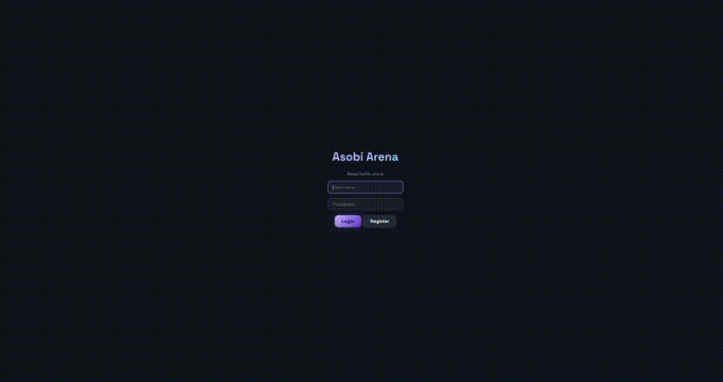

<p align="center">
  
</p>

<p align="center">
  <a href="https://hex.pm/packages/asobi"></a>
  <a href="https://github.com/widgrensit/asobi/actions/workflows/ci.yml"></a>
  <a href="LICENSE"></a>
</p>

<p align="center">
  <strong>Multiplayer game backend on Erlang/OTP.</strong><br>
  Per-match supervision. Hot-reloadable Lua. Zero-downtime deploys. 100K+ connections per node.
</p>

<p align="center">
  <a href="https://play.asobi.dev">
    
  </a>
  <br>
  <em><a href="https://play.asobi.dev">Try the live demo</a> · <a href="https://asobi.dev">asobi.dev</a></em>
</p>

## Why Asobi

The BEAM VM was built for telecoms switches handling millions of concurrent
connections with soft real-time guarantees. That turns out to be the exact
shape of a multiplayer game backend.

- **Each match is an OTP process** — crashes restart in milliseconds without
  touching the neighbours. No stop-the-world GC pauses affecting other players.
- **Lua scripting with hot reload** — edit your match module, save, watch the
  server pick it up live. No container rebuilds, no reconnects.
- **Zero-downtime deploys** — rolling releases via standard OTP release
  handling. Players keep playing through the upgrade.
- **Single-node capacity** — one machine comfortably holds 100K+ WebSocket
  connections, so "scale" usually means "shard by game", not "rebuild for
  Kubernetes".
- **No external state stores** — ETS replaces Redis for hot state; OTP `pg`
  replaces Redis pub/sub. One release, one PostgreSQL, done.

## How Asobi compares

|                      | **Asobi**                  | Nakama            | Colyseus        | SpacetimeDB      |
| -------------------- | -------------------------- | ----------------- | --------------- | ---------------- |
| Runtime              | BEAM (Erlang/OTP)          | Go                | Node.js         | Rust + WASM      |
| GC model             | Per-process, isolated      | Stop-the-world    | Stop-the-world  | Custom           |
| Fault tolerance      | OTP supervision trees      | Manual recovery   | Manual recovery | Transactional    |
| Pub/Sub              | Built-in (`pg`)            | Requires Redis    | Built-in        | Built-in         |
| Connections / node   | 100K+                      | ~50K              | ~10K            | ~10K             |
| Hot reload           | Yes (Lua + Erlang modules) | Lua/TypeScript    | TypeScript      | No               |
| Scripting            | Lua (Luerl, in-VM)         | Lua / JS / Go     | JS / TS         | Rust / C#        |
| License              | Apache-2.0                 | Apache-2.0 / BSL  | MIT             | BSL              |

## Features

- **Authentication** — register, login, session tokens via [nova_auth](https://github.com/novaframework/nova_auth)
- **Player management** — profiles, stats, metadata
- **Real-time multiplayer** — WebSocket transport, server-authoritative game loop with configurable tick rate
- **Matchmaking** — pluggable strategies (fill, skill-based) with query windows and party support
- **Leaderboards** — ETS for microsecond reads, PostgreSQL for persistence
- **Virtual economy** — wallets, transactions, item definitions, store, inventory
- **Social** — friends, groups/guilds, chat channels, presence, notifications
- **Tournaments** — scheduled competitions with entry fees and rewards
- **Cloud saves** — per-slot save data with optimistic concurrency
- **Generic storage** — key-value storage with permissions (public/owner/none)
- **Background jobs** — powered by [Shigoto](https://github.com/Taure/shigoto)
- **Admin dashboard** — real-time console via [Arizona](https://github.com/novaframework/arizona_core)

## Quick start with Lua (Docker)

No Erlang needed. Just Lua scripts and Docker.

```bash
mkdir my_game && cd my_game
mkdir -p lua/bots
```

Write your game logic in Lua:

```lua
-- lua/match.lua
match_size = 2
max_players = 4
strategy = "fill"

function init(config)
    return { players = {} }
end

function join(player_id, state)
    state.players[player_id] = { x = 400, y = 300, hp = 100 }
    return state
end

function leave(player_id, state)
    state.players[player_id] = nil
    return state
end

function handle_input(player_id, input, state)
    local p = state.players[player_id]
    if not p then return state end
    if input.right then p.x = p.x + 5 end
    if input.left  then p.x = p.x - 5 end
    return state
end

function tick(state)
    return state
end

function get_state(player_id, state)
    return { players = state.players }
end
```

Add a `docker-compose.yml`:

```yaml
services:
  postgres:
    image: postgres:16
    environment:
      POSTGRES_USER: postgres
      POSTGRES_PASSWORD: postgres
      POSTGRES_DB: my_game_dev
    healthcheck:
      test: ["CMD-SHELL", "pg_isready -U postgres"]
      interval: 5s
      timeout: 5s
      retries: 5

  asobi:
    image: ghcr.io/widgrensit/asobi_lua:latest
    depends_on:
      postgres: { condition: service_healthy }
    ports:
      - "8080:8080"
    volumes:
      - ./lua:/app/game:ro
    environment:
      ASOBI_DB_HOST: postgres
      ASOBI_DB_NAME: my_game_dev
```

```bash
docker compose up -d
```

Your game backend is running — authentication, matchmaking, WebSocket transport, and everything else handled by Asobi.

## Quick start with Erlang

For Erlang/OTP developers who want full control, add asobi as a dependency:

```erlang
{deps, [
    {asobi, "~> 0.25"}
]}.
```

Implement the `asobi_match` behaviour:

```erlang
-module(my_arena_game).
-behaviour(asobi_match).

-export([init/1, join/2, leave/2, handle_input/3, tick/1, get_state/2]).

init(_Config) ->
    {ok, #{players => #{}}}.

join(PlayerId, #{players := Players} = State) ->
    {ok, State#{players => Players#{PlayerId => #{x => 0, y => 0}}}}.

leave(PlayerId, #{players := Players} = State) ->
    {ok, State#{players => maps:remove(PlayerId, Players)}}.

handle_input(_PlayerId, _Input, State) ->
    {ok, State}.

tick(State) ->
    {ok, State}.

get_state(_PlayerId, #{players := Players}) ->
    Players.
```

Register it in `sys.config` and start with `rebar3 shell`. See the [Getting Started](guides/getting-started.md) guide for the full walkthrough.

## Stack

| Layer             | Technology                                                          |
| ----------------- | ------------------------------------------------------------------- |
| HTTP / REST       | [Nova](https://github.com/novaframework/nova) (Cowboy)              |
| WebSocket         | Nova WebSocket (Cowboy)                                             |
| Database / ORM    | [Kura](https://github.com/Taure/kura) (PostgreSQL via pgo)          |
| Real-time UI      | [Arizona](https://github.com/novaframework/arizona_core)            |
| Authentication    | [nova_auth](https://github.com/novaframework/nova_auth)             |
| Background jobs   | [Shigoto](https://github.com/Taure/shigoto)                         |
| Pub/Sub           | OTP `pg` module                                                     |
| Lua runtime       | [Luerl](https://github.com/rvirding/luerl) (Lua-on-BEAM)            |

## Status

Asobi is in **public preview** — fully open-source, API stabilising.
Early-adopter friendly; expect to read code occasionally.

| Area                         | Status     |
| ---------------------------- | ---------- |
| Authentication               | Stable     |
| Matchmaking                  | Stable     |
| Real-time WebSocket transport| Stable     |
| Leaderboards                 | Stable     |
| Virtual economy              | Stable     |
| Social (friends / chat)      | Stable     |
| Lua scripting + hot reload   | Stable     |
| Admin dashboard (Arizona)    | Beta       |
| Cloud saves                  | Beta       |
| Tournaments                  | Beta       |
| Client SDKs (Unity/Godot/Defold/Dart) | Alpha |
| Managed cloud offering       | [Coming soon](https://asobi.dev/cloud) |

## Documentation

- [Getting started](guides/getting-started.md) — Lua (Docker) or Erlang setup
- [Lua scripting](guides/lua-scripting.md) — write game logic in Lua
- [Bots](guides/lua-bots.md) — add AI-controlled players
- [Configuration](guides/configuration.md) — all configuration options
- [REST API](guides/rest-api.md) — full API reference
- [WebSocket protocol](guides/websocket-protocol.md) — real-time message types
- [Matchmaking](guides/matchmaking.md) — query-based player matching
- [Economy](guides/economy.md) — wallets, items, and store
- [Architecture](docs/ARCHITECTURE.md) — system design

Full API docs on [HexDocs](https://hexdocs.pm/asobi).

## Community

- [Discord](https://discord.gg/vYSfYYyXpu) — ask questions, share what you're building
- [Issues](https://github.com/widgrensit/asobi/issues) — bug reports and feature requests
- [asobi.dev/blog](https://asobi.dev/blog) — design notes and release updates

## License

Apache-2.0
