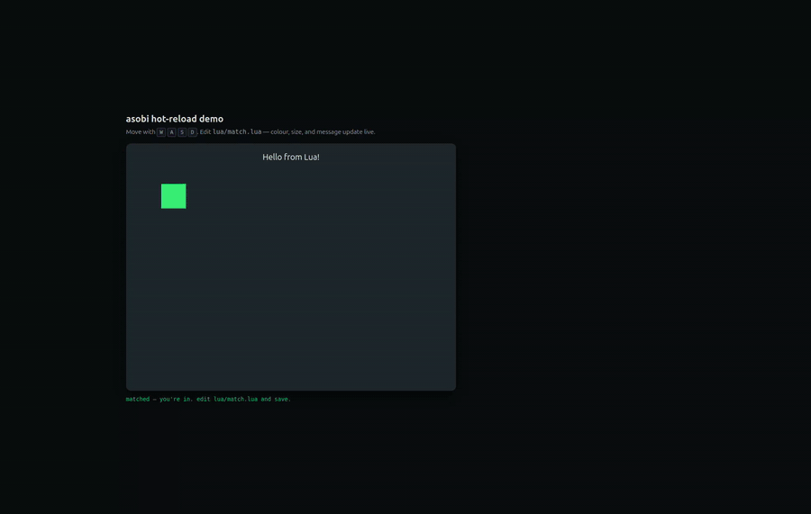

<p align="center">
  <picture>
    <source media="(prefers-color-scheme: dark)" srcset="docs/media/logo-dark.png">
    
  </picture>
</p>

<h1 align="center">asobi</h1>

<p align="center">
  <b>Multiplayer game backend on Erlang/OTP. Hot-reloadable, Apache-2.</b>
</p>

<p align="center">
  <a href="https://hex.pm/packages/asobi"></a>
  <a href="https://hexdocs.pm/asobi"></a>
  <a href="https://github.com/widgrensit/asobi/actions/workflows/ci.yml"></a>
  <a href="LICENSE"></a>
</p>

<p align="center">
  <a href="https://asobi.dev/docs">Docs</a> •
  <a href="https://asobi.dev/demo">Live demo</a> •
  <a href="https://discord.gg/vYSfYYyXpu">Discord</a> •
  <a href="https://github.com/widgrensit/asobi/issues">Issues</a>
</p>

<p align="center">
  
  <br>
  <em>Edit a Lua file. Save. Live match updates. No restart. <a href="examples/hotreload-demo/">Try it.</a></em>
</p>

---

## Who it's for

Solo devs and small teams building **indie 2D multiplayer**. If you're on
Godot, Defold, LÖVE, Phaser, or Flame+Flutter, asobi ships the backend
pieces you'd otherwise rebuild from scratch: matches, matchmaker, chat,
leaderboards, economy, voting, phases, worlds, presence, inventory.

Not the right fit for twitch-latency AAA shooters - WebSocket/TCP has a
floor around 4ms. Great for turn-based, casual, MMO zone, roguelike,
co-op, party, and social games.

## Try it in 60 seconds

```bash
git clone https://github.com/widgrensit/asobi
cd asobi/examples/hotreload-demo && docker compose up
```

Open <http://localhost:3000>, then edit `lua/match.lua` and save. The
running match picks the new code up on its next tick. No restart, no
reconnect, no kicked players.

## One product, two front doors

asobi is a single Erlang/OTP node holding the game backend, the Lua
runtime, and the operator console. Pick the surface you want to write
against; it is the same node either way.

**Write your game in Lua.** Run `ghcr.io/widgrensit/asobi` and mount a
directory of Lua scripts over `/app/game`. This is the default path and
what most people want.

**Write your game in Erlang.** Depend on the Hex package and implement
the `asobi_match` behaviour. Same match supervisor, matchmaker,
leaderboards, economy, world server, and voting primitives, composed into
your own release.

```erlang
%% rebar.config
{deps, [
    {asobi, "~> 0.68"}
]}.
```

[Getting started](guides/getting-started.md) covers both.

## Features

- **`asobi_match`** - behaviour for per-match logic, backed by a supervised `gen_server` with ETS state backup on crash.
- **`asobi_matchmaker`** - pluggable strategies (`fill`, `skill_based`); your own via the `asobi_matchmaker_strategy` behaviour.
- **`asobi_world_server`** - zoned worlds with lazy zone loading, spatial grid indexing, terrain chunk serving, and cold-zone tick throttling.
- **`asobi_vote_server`** - plurality, ranked choice, approval, weighted. Fixed / ready-up / hybrid / adaptive windows. Spectator voting, veto tokens, majority-tyranny mitigations.
- **`asobi_phase`, `asobi_timer`** - phase engine, plus `countdown` / `conditional` / `cycle` / `scheduled` timer primitives. Seasons moved out to [`asobi_seasons`](https://github.com/widgrensit/asobi_seasons), an extension.
- **Auth** - email/password, Google / Apple / Steam sign-in, and **guest (anonymous) play** with device-based create-or-resume and upgrade-to-account (game-declared, operator-peppered).
- **Rate limiting** via `seki` (sliding window, per route group), **sessions** cached in ETS, **presence** via `pg`, **chat / social / economy / inventory / storage / tournaments / notifications** as Nova controllers.
- **Extensions** - game-specific methods, callable as an `rpc.call` WebSocket frame and over `/api/v1/ops/ext/:extension/:action`. See [Extensions](guides/extensions.md).
- **Client SDKs** for Godot, Defold, Unity, Unreal, JS/TS, Dart, Flame - [see below](#client-sdks).
- **Operator console** - a browser UI over the ops plane, read-only today: players, matches, matchmaker queue, leaderboards, economy, chat, tournaments, notifications. Served by the node itself at `/console`, off until you turn it on.

## Benchmarks

Single node, 8 cores, same-machine client. See [guides/benchmarks.md](guides/benchmarks.md) for full numbers.

| | Peak |
|---|---|
| WebSocket throughput | **83,000 msg/sec** @ 3,500 concurrent connections |
| RTT p50 / p99 | 4.4 ms / 6.5 ms |
| REST reads (matches / friends / wallets) | 7-14 ms p50 |
| Memory per connection | ~15 KB |

Not a twitch-FPS backend; WebSocket/TCP has a latency floor. Excellent for
turn-based, casual, MMO zone, roguelike, co-op, and party games. Pair with a
UDP relay if you need sub-3ms physics.

## Client SDKs

| Engine | Package | Docs | Example |
|---|---|---|---|
| **Godot 4.x** (GDScript) | [asobi-godot](https://github.com/widgrensit/asobi-godot) | [Guide](https://asobi.dev/godot) | [Demo](https://github.com/widgrensit/asobi-godot-demo) |
| **Defold** (Lua) | [asobi-defold](https://github.com/widgrensit/asobi-defold) | [Guide](https://asobi.dev/defold) | [Demo](https://github.com/widgrensit/asobi-defold-demo) |
| **LÖVE** (Lua) | [asobi-love2d](https://github.com/widgrensit/asobi-love2d) | - | _demo planned_ |
| **Phaser** (TypeScript) | [asobi-js](https://github.com/widgrensit/asobi-js) (browser) | - | _example planned, [#103](https://github.com/widgrensit/asobi/issues/103)_ |
| **Unity 2021.3+** (C#) | [asobi-unity](https://github.com/widgrensit/asobi-unity) | [Guide](https://asobi.dev/unity) | [Demo](https://github.com/widgrensit/asobi-unity-demo) |
| **Unreal Engine 5** (C++) | [asobi-unreal](https://github.com/widgrensit/asobi-unreal) | - | - |
| **TypeScript / JS** (Browser + Node) | [asobi-js](https://github.com/widgrensit/asobi-js) | - | - |
| **Dart / Flutter** | [asobi-dart](https://github.com/widgrensit/asobi-dart) | [Guide](https://asobi.dev/dart) | - |
| **Flame** (Flutter) | [flame_asobi](https://github.com/widgrensit/flame_asobi) | - | [Demo](https://github.com/widgrensit/asobi-flame-demo) |

## Documentation

- [**Glossary**](guides/glossary.md) - the self-hosted node vs asobi.dev Cloud. Start here if the names blur.
- [**Getting started**](guides/getting-started.md) - stand up a local node, in Lua or in Erlang
- [**Self-hosting**](guides/self-hosting.md) - requirements, production compose, operating notes
- [**Architecture**](guides/architecture.md) - supervision tree, modules, design
- [**REST API**](guides/rest-api.md) · [**WebSocket protocol**](guides/websocket-protocol.md)
- [**Matchmaking**](guides/matchmaking.md) · [**Lobbies**](guides/lobbies.md) · [**Voting**](guides/voting.md) · [**Phases**](guides/phases.md)
- [**World server**](guides/world-server.md) · [**Large worlds**](guides/large-worlds.md)
- [**Economy**](guides/economy.md) · [**Authentication**](guides/authentication.md) · [**IAP**](guides/iap.md)
- [**Lua scripting**](guides/lua-scripting.md) · [**Lua API reference**](guides/lua-api.md) · [**Lua bots**](guides/lua-bots.md)
- [**Extensions**](guides/extensions.md) - add your own RPC methods and ops actions
- [**Configuration**](guides/configuration.md) · [**Operator console**](guides/console.md) · [**Clustering**](guides/clustering.md) · [**Performance tuning**](guides/performance-tuning.md)
- [**Benchmarks**](guides/benchmarks.md) · [**Comparison vs Nakama / Colyseus / SpacetimeDB**](guides/comparison.md)
- [**HexDocs**](https://hexdocs.pm/asobi) - full API reference

## Migrating?

- [**from Hathora**](guides/migrate-from-hathora.md) - Hathora shuts down 2026-05-05.
- [**from PlayFab**](guides/migrate-from-playfab.md)
- [**from Nakama self-host**](guides/migrate-from-nakama.md)

## Related projects

- Lua scripting and the operator console ship in asobi itself - see [Self-hosting](guides/self-hosting.md)
- Docker image: `ghcr.io/widgrensit/asobi`, release binary `bin/asobi`
- Client SDKs: [asobi-godot](https://github.com/widgrensit/asobi-godot) · [asobi-defold](https://github.com/widgrensit/asobi-defold) · [asobi-love2d](https://github.com/widgrensit/asobi-love2d) · [asobi-unity](https://github.com/widgrensit/asobi-unity) · [asobi-unreal](https://github.com/widgrensit/asobi-unreal) · [asobi-js](https://github.com/widgrensit/asobi-js) · [asobi-dart](https://github.com/widgrensit/asobi-dart) · [flame_asobi](https://github.com/widgrensit/flame_asobi)

## Stability

asobi is pre-1.0. The API is stabilising; expect minor breaking changes
until 1.0. We will never relicense - see [guides/exit.md](guides/exit.md)
for the "if asobi disappears tomorrow" runbook.

## Run it yourself, or use the cloud

asobi is Apache-2 and self-hostable. One Docker container runs the full
stack; see [`docker-compose.example.yml`](docker-compose.example.yml) for
a production-shaped setup with Postgres.

Don't want to operate it? [**asobi.dev/cloud**](https://asobi.dev/cloud)
is the managed version, EU-sovereign, same open-source core. If we ever
pivot, you still have the code - see [guides/exit.md](guides/exit.md).

## FAQ

**Does asobi replace Nakama / Colyseus / PlayFab?**
For the indie-2D multiplayer slot, yes. For AAA shooters needing
per-match dedicated UDP servers, no; pair asobi with a UDP relay.

**Can I write my game logic in something other than Lua?**
Yes. Depend on asobi as an Erlang library and write match code in Erlang,
or call the REST/WebSocket API from any language. Lua is the easy mode.

**Does it scale across machines?**
asobi is single-node by design, and several subsystems are node-local:
the matchmaker queue and its tickets, rate-limit buckets, and console
sessions all live in the node that served the request, so players queuing
against different nodes never match each other. Matches and worlds do not
migrate. Shard at the app level (game-per-node, region-per-node) rather
than clustering a single match across hosts. The full list of what is
per-node is in [Clustering](guides/clustering.md).

**What happens if asobi disappears?**
Apache-2, single-binary deploy, Postgres backing store. Nothing in your
stack is load-bearing on us. See [guides/exit.md](guides/exit.md).

## Contributing

See [CONTRIBUTING.md](CONTRIBUTING.md) for the build setup, pre-push
checklist, and test matrix. Security issues: see [SECURITY.md](SECURITY.md).

## License

Apache-2.0. See [LICENSE](LICENSE).
